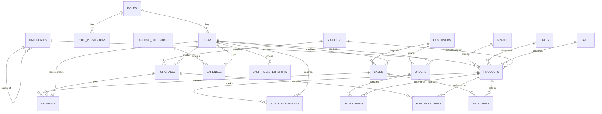

# NovaPOS — Entity Relationship Design (Phase 1)

This is the schema we'll implement as migrations next. Every table here maps
directly to a screen already built in the UI. Nothing here is final until
we sign off on it — flag anything that doesn't match how you want the
business logic to work before we turn this into migrations.

---

## Entities

### `roles`
Staff roles — Admin, Cashier, Accountant, Manager (matches the login
screen's role dropdown).
| Column | Type | Notes |
|---|---|---|
| id | bigint | PK |
| name | string | e.g. "Cashier" |
| slug | string, unique | e.g. "cashier" |

### `role_permissions`
Per-role, per-module access matrix (view/add/edit/delete) — backs the
"Role & Permissions" screen under People.
| Column | Type | Notes |
|---|---|---|
| id | bigint | PK |
| role_id | FK → roles | |
| module | string | e.g. "products", "sales", "pos", "purchases", "people", "accounts", "reports", "settings" |
| can_view / can_add / can_edit / can_delete | boolean | |

### `users` (staff)
Extends Laravel's default `users` table.
| Column | Type | Notes |
|---|---|---|
| id | bigint | PK |
| name, email, password | — | Laravel defaults |
| phone | string, nullable | |
| role_id | FK → roles | |
| status | enum('active','inactive') | |
| avatar | string, nullable | |

### `categories`
| Column | Type | Notes |
|---|---|---|
| id | bigint | PK |
| name, slug | string | |
| parent_id | FK → categories, nullable | supports subcategories |
| status | enum('active','inactive') | |

### `brands`
| id | name | slug | status |

### `units`
Units of measurement (Pieces, Kg, Box, Liter).
| id | name | short_code |

### `taxes`
| id | name | rate (decimal) | is_default (bool) |

### `products`
| Column | Type | Notes |
|---|---|---|
| id | bigint | PK |
| name, sku (unique), barcode (unique, nullable) | string | |
| category_id | FK → categories | |
| brand_id | FK → brands, nullable | |
| unit_id | FK → units | |
| tax_id | FK → taxes, nullable | |
| supplier_id | FK → suppliers, nullable | primary/default supplier |
| cost_price, sale_price | decimal(12,2) | |
| current_stock | integer | cached; kept in sync via `stock_movements` |
| reorder_level | integer | powers low-stock alerts |
| description | text, nullable | |
| image | string, nullable | |
| status | enum('active','inactive') | |

### `customers`
| id | name, phone, email, address | opening_balance, current_balance (decimal — outstanding due) | status |

### `suppliers`
| id | name, phone, email, address | opening_balance, current_balance (decimal — outstanding payable) | status |

### `sales`
| Column | Type | Notes |
|---|---|---|
| id | bigint | PK |
| invoice_no | string, unique | |
| customer_id | FK → customers, nullable | null = walk-in |
| user_id | FK → users | cashier who made the sale |
| sale_date | datetime | |
| subtotal, discount, tax_total, grand_total | decimal(12,2) | |
| paid_amount, due_amount | decimal(12,2) | |
| payment_status | enum('paid','partial','due') | |
| status | enum('completed','refunded','held','cancelled') | "held" = parked order |
| notes | text, nullable | |

### `sale_items`
| id | sale_id (FK) | product_id (FK) | quantity | unit_price | discount | tax | line_total |

### `purchases`
| Column | Type | Notes |
|---|---|---|
| id | bigint | PK |
| po_no | string, unique | |
| supplier_id | FK → suppliers | |
| user_id | FK → users | who created the PO |
| purchase_date | datetime | |
| subtotal, discount, tax_total, grand_total | decimal(12,2) | |
| paid_amount, due_amount | decimal(12,2) | |
| status | enum('draft','ordered','received','partially_received','cancelled') | |
| payment_status | enum('paid','partial','due') | |

### `purchase_items`
| id | purchase_id (FK) | product_id (FK) | quantity | received_quantity | unit_cost | tax | line_total |

### `orders`
(Distinct from `sales` — for pickup/delivery orders awaiting fulfillment.)
| id | order_no | customer_id (FK, nullable) | user_id (FK) | order_date | fulfillment_type enum('pickup','delivery') | status enum('pending','processing','ready','completed','cancelled') | subtotal, discount, tax_total, grand_total | notes |

### `order_items`
| id | order_id (FK) | product_id (FK) | quantity | unit_price | line_total |

### `stock_movements`
The audit log every stock change writes to — sales, purchases,
adjustments, transfers, returns all flow through here.
| Column | Type | Notes |
|---|---|---|
| id | bigint | PK |
| product_id | FK → products | |
| type | enum('purchase_in','sale_out','adjustment_in','adjustment_out','transfer_in','transfer_out','return_in','return_out') | |
| quantity | integer | always positive; `type` determines direction |
| balance_after | integer | running stock snapshot |
| reference_type, reference_id | string, bigint, nullable | polymorphic — links back to the Sale/Purchase/etc. that caused it |
| reason | string, nullable | for manual adjustments |
| user_id | FK → users | |

### `payments`
Polymorphic — a payment can apply to a `Sale` (customer paying) or a
`Purchase` (paying a supplier).
| id | payable_type, payable_id (morph) | amount | method enum('cash','card','wallet','bank') | reference_no, nullable | received_by (FK → users) | paid_at |

### `expense_categories`
| id | name |

### `expenses`
| id | expense_category_id (FK) | amount | expense_date | payment_method | reference_no, nullable | notes, nullable | attachment_path, nullable | user_id (FK) |

### `cash_register_shifts`
| id | user_id (FK) | opened_at | closed_at, nullable | opening_cash | expected_cash, nullable | counted_cash, nullable | variance, nullable | status enum('open','closed') | notes, nullable |

---

## Relationships (Mermaid ERD)

---

## Design Decisions Worth Confirming

1. **`orders` vs `sales`** — kept separate, matching the original UI spec
   (Orders = pickup/delivery fulfillment queue; Sales = completed POS/store
   transactions). If your business only ever does in-store POS sales with
   no separate delivery/pickup queue, we can drop `orders`/`order_items`
   entirely and simplify the sidebar. **Confirm before Phase 9.**
2. **`current_stock` is a cached column**, not computed live from
   `stock_movements` on every read — better performance for the
   dashboard/product list, kept in sync whenever a movement is recorded.
3. **`payments` is polymorphic** (one table for both customer payments on
   sales and supplier payments on purchases) rather than two separate
   tables — less duplication, same pattern either way works fine if you'd
   rather keep them split.
4. **Multi-location/warehouse stock** is *not* in this schema yet — the
   original UI spec mentioned it as optional. If you need multiple
   branches/warehouses, we add a `warehouses` table and a
   `product_id + warehouse_id` composite stock table instead of the single
   `current_stock` column. **Confirm before Phase 1 migrations are written.**

---

## Next Step

Once you confirm (or adjust) the points above, we turn this directly into
migrations + Eloquent models — that's the next checklist item in Phase 1.
